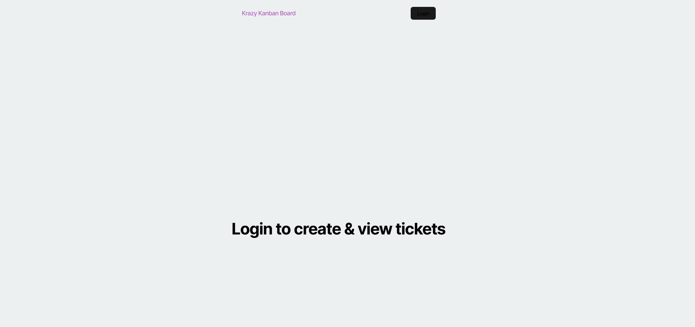
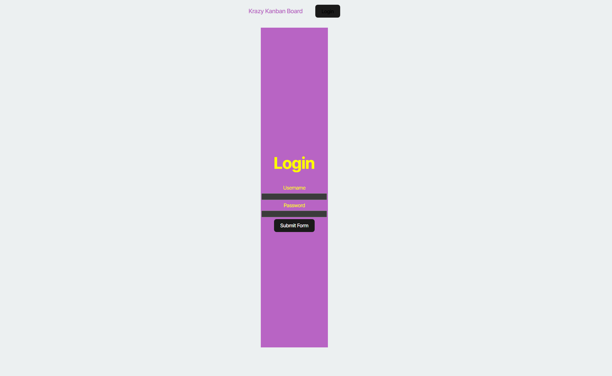
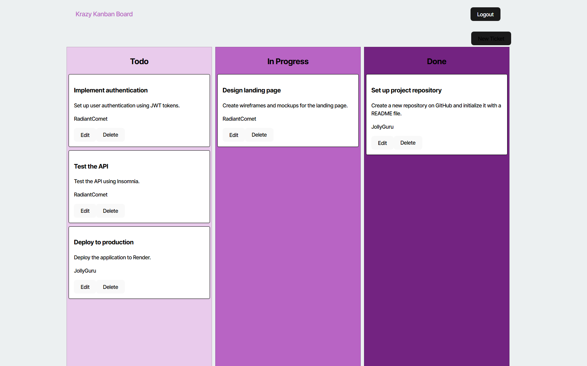
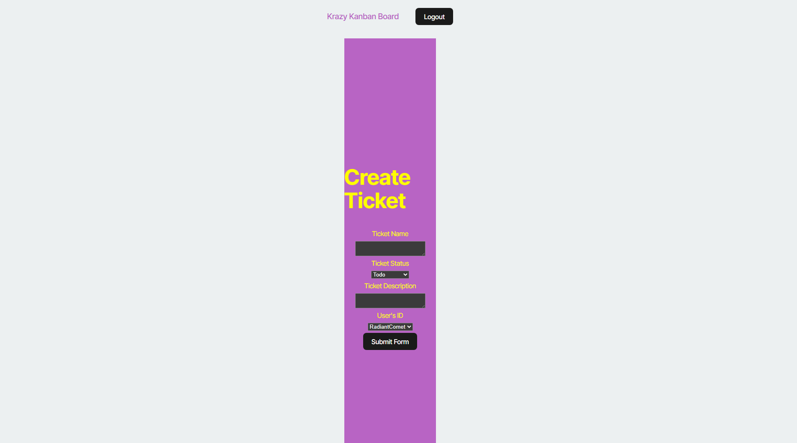

# Kanban Board

## Description

This project is a full-stack application of a Kanban Board that uses JWTs to authenticate logins and further access of the app. Users can only continue with the app if logged in with an acceptable user login and password. Each user has their own token and after inactivity for a period of time the session expires and the token is invalidated. Developing this project helped me to understand JWTs and authentication and how to apply in a full-stack application while also strengthening coding skills in learned technologies such as React and TypeScript.

## Table of Contents

- [Description](#description)
- [Installation](#installation)
- [Usage](#usage)
- [Credits](#credits)

## Installation

If running app locally, in the terminal run the "install", "build" and "seed" commands. After doing so the app can be started with the "start" or "start:dev" commands. To find seeded user login info, view in seeds folder.

## Usage

Here is a link to the deployed app: [Deployed Link](https://kanbanboard-hvp0.onrender.com)

Landing Page: 

When the app is launched this is the landing page. If the token is removed from the local storage after logging in the user will also be redirected to this page.

Login Page:

This page prompts a form where you can enter in a username and password to access the rest of the app.

This is what will load when there is no user logged in but the user tries to access one of the other pages beyond the login page.

Dashboard:

Once the user is logged in the Kanban Board will be presented.

Users can also access the "create ticket" page with button above the "Done" column.

## Credits

Below is my GitHub profile. Any suggestions to improve functionality and code, feel free to reach out to me!

GitHub: https://github.com/AVue00

